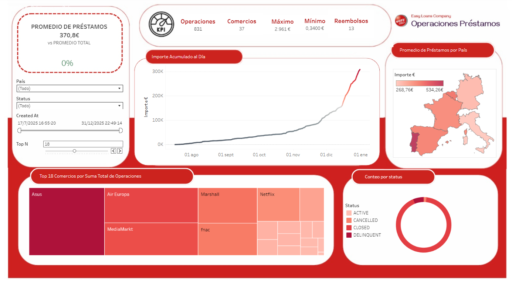

# Business Intelligence con Tableau

Dashboard interactivo de Business Intelligence desarrollado con Tableau Desktop como parte del módulo de **Business Intelligence con Tableau** del Máster en Data Science, Big Data & Business Analytics en la Universidad Complutense de Madrid.

[](https://public.tableau.com/app/profile/daniel.molina.novoa/viz/PracticaDanielMolinafinal/DashboardEasyLoans)

---

# Vista del Dashboard



---

## Caso Práctico: Easy Loans — Análisis de Operaciones de Préstamos (2023)

**Easy Loans** es una empresa financiera que concede préstamos para la adquisición de productos en establecimientos europeos. El objetivo del análisis es extraer insights sobre las operaciones realizadas durante 2023 que apoyen la toma de decisiones estratégicas.

**Pregunta de negocio principal:**
> *¿Cómo se distribuyen las operaciones de préstamo por país, comercio y estado, y cuál es la evolución acumulada de los ingresos a lo largo del año?*

---

## Desarrollo técnico

### Modelado de datos
- Conexión a fuente de datos Excel (`Easy Loans Operaciones 2023.xlsx`)
- Modelo relacional con tres tablas: `Orders`, `Merchants` y `Refunds`
- Filtro de fuente de datos: exclusión de operaciones en Marruecos (solo mercados europeos)
- Guardado en formato `.twbx` para preservar datos y configuraciones

### Campos calculados
| Campo | Descripción |
|-------|-------------|
| Promedio Préstamos | Precio medio de todos los préstamos |
| Sumatorio Préstamos | Suma total de los importes |
| Máximo / Mínimo | Valores extremos de los préstamos |
| Total Comercios | Conteo de comercios distintos |
| Total Operaciones | Número total de operaciones |
| Total Reembolsos | Conteo de reembolsos |
| Valor Acumulado | Importe acumulado con `RUNNING_SUM` |
| Promedio Total | Media fija con `FIXED` (Level of Detail) |
| Desviación del Promedio | Variación del promedio seleccionado vs. promedio total |
| Leyenda Promedio | Campo condicional para indicador ▲/▼ |

### Visualizaciones
- **KPI Principal:** Promedio de préstamos seleccionados vs. promedio total con indicador de desviación
- **KPIs Secundarios:** Operaciones, Comercios, Máximo, Mínimo y Reembolsos
- **Mapa geográfico:** Promedio de préstamos por país con gradiente de color
- **Gráfico de líneas:** Importe acumulado al día con color según sumatorio
- **Tree Map:** Top N comercios por suma total de operaciones
- **Pie Chart:** Distribución de operaciones por estado (ACTIVE, CLOSED, CANCELLED, DELINQUENT)

### Interactividad
- **Filtros globales** aplicados a todas las hojas: País, Status y rango de fechas (Created At)
- **Parámetro Top N:** Control dinámico para filtrar el número de comercios mostrados en el Tree Map
- **Acción de dashboard:** Clic en el mapa filtra el resto de visualizaciones

---

## Tecnologías


- **Herramienta:** Tableau Desktop
- **Fuente de datos:** Microsoft Excel (.xlsx)
- **Publicación:** Tableau Public

---

## Estructura del repositorio

```
tableau-business-intelligence/
│
└── easy-loans-dashboard/
    ├── dashboard-preview.png     # Captura del dashboard final
    └── easy-loans-analysis.twbx  # Archivo Tableau (opcional)
```

---

## Autor

**Daniel Molina Novoa** · Data Analyst  
[](https://www.linkedin.com/in/daniel-molina-novoa-78106925a/)
[](https://github.com/danielmolinan)
[](https://public.tableau.com/app/profile/daniel.molina.novoa)
